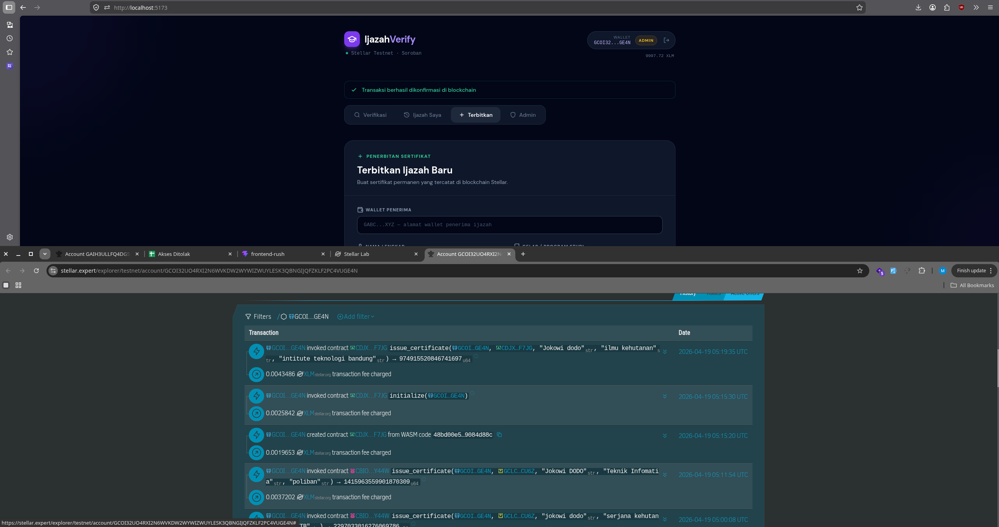
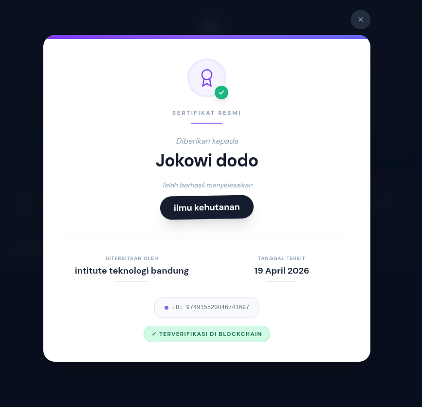

# IjazahVerify 🎓

IjazahVerify is a blockchain-based certificate verification platform running on the **Stellar (Soroban Testnet)** network. This system allows institutions to issue certificates on-chain, providing full security and transparency regarding the authenticity of educational documents.

## 🚀 Key Features

- **Certificate Verification**: Anyone can verify the authenticity of a certificate using its unique Certificate ID.
- **Certificate Issuance**: Registered institutions can issue new certificates directly to the recipient's wallet.
- **Certificate Revocation**: Institutions can revoke certificates in case of errors or cancellations.
- **Institution Management**: System admins can register wallet addresses as official institutions.

## 📁 Project Structure

```text
submition/
├── contracts/
│   ├── ijazah-verify/     # Smart Contract implementation (Rust/Soroban)
│   └── deploy.sh          # Automated deployment script
├── frontend-rush/         # Web dashboard (React + TS + Vite)
│   └── .env               # RPC configuration and Contract ID
└── README.md              # Project documentation
```

## 🛠 Installation & Deployment Guide

### 1. Prerequisites
- [Rust](https://www.rust-lang.org/) & [Soroban SDK](https://soroban.stellar.org/docs/getting-started/setup)
- [Stellar CLI](https://developers.stellar.org/docs/build/smart-contracts/getting-started/setup)
- [Node.js](https://nodejs.org/) & [Bun](https://bun.sh/) (or npm)
- [Freighter Wallet](https://www.freighter.app/) Browser Extension

### 2. Deploy Smart Contract
Ensure you have the `alice` identity configured in Stellar CLI (`stellar keys add alice`).

```bash
cd submition/contracts
bash deploy.sh
```
*This script will build, optimize, deploy the contract, and automatically update the `.env` file in the frontend directory.*

### 3. Run Frontend
```bash
cd submition/frontend-rush
bun install
bun run dev
```
The application will be accessible at `http://localhost:5173`.

## 🌐 Deployment Information (Testnet)

- **Network**: Stellar Testnet
- **Contract ID**: `CALFLU7NZTUEE5UPAEFQYDPOO7JMKIOARC2MNDQ7LW2VHRXLBPIZ7CD3`
- **RPC URL**: `https://soroban-testnet.stellar.org`

## 📸 Testing & Screenshots

### 1. Contract Interaction & Explorer
Evidence of successful contract deployment and `issue_certificate` invocation on the Stellar Testnet.


### 2. Verified Certificate
Example of a generated certificate successfully verified against the blockchain data.


## 📖 How to Use

1. **Connect Wallet**: Click the "Connect Wallet" button using the Freighter extension.
2. **Institution Setup**: (Admin Only) Use the `deploy.sh` script or call the `register_institution` function via CLI to authorize your address as an institution.
3. **Issue Certificate**: Navigate to the "Issue" (Terbitkan) tab, enter the recipient's details, and sign the transaction.
4. **My Certificates**: Wallet owners can view their certificates in the "My Certs" (Ijazah Saya) tab.
5. **Public Verification**: Enter a Certificate ID on the home page to verify authenticity instantly without logging in.

---
Developed for the **Stellar Workshop**.
